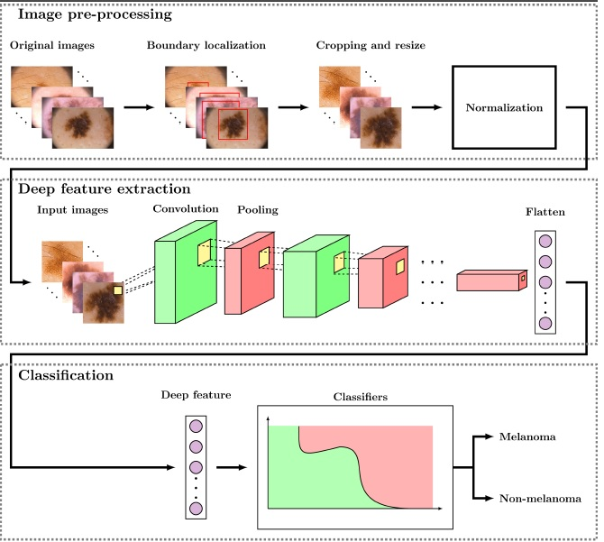

# Comprehensive_analysis_melanoma_detection
We present an automated framework that extracts visual features from dermoscopy images using a pretrained deep CNN model

Abstract: 

Melanoma is the fastest growing and most lethal cancer among all forms of skin cancer. Deep learning methods, mainly convolutional neural networks (CNNs) have recently brought considerable attention in detecting skin cancers from dermoscopy images. However, learning valuable features by these methods has been challenging due to the inadequate training data, inter-class similarity, and intra-class variation in the skin lesions. In addition, most of these methods demand a considerable amount of parameters to tune. To address these issues, we present an automated framework that extracts visual features from dermoscopy images using a pretrained deep CNN model and then employs a set of classifiers to detect melanoma. Recently, few pre-trained CNN architectures have been employed to extract deep features from skin lesions. However, a comprehensive analysis of such features derived from a variety of CNN architectures has not yet been performed for melanoma classification. Therefore, in this paper, we investigate the effectiveness of deep features extracted from eight contemporary CNN models. Also, we explore the impact of boundary localization and normalization techniques on melanoma detection. The suggested approach is evaluated using four benchmark datasets: PH2, ISIC 2016, ISIC 2017 and HAM10000. Experimental outcomes indicate that the DenseNet-121 with multi-layer perceptron (MLP) achieves a higher performance in terms of accuracy of 98.33%, 80.47%, 81.16% and 81% on PH2, ISIC 2016, ISIC 2017 and HAM10000 datasets compared to other CNN models and state-of-the-art methods.

Introduction:

In general, deep learning techniques learn relevant features when trained with a huge amount of data. However, the size of the publicly
available skin cancer dataset is insufficient to train such deep learning models. In addition, these models require enormous parameters, which may lead to overfitting while working with limited data. Further, many earlier CNN models extract features directly from original images that may ignore the important visual features of the lesion region. To handle these issues, we extract the region of interest (ROIs) by introducing a boundary localization technique and present a framework for automatic and accurate melanoma recognition in dermoscopy images, where we use a deep CNN model pre-trained with a large-scale dataset to extract prominent features followed by a set of classifiers for melanoma classification. Limited work has been reported to date using such methods. To the best of our knowledge, the efficacy of a variety of contemporary pre-trained CNN models has not yet been fully investigated for skin cancer detection.

The main contributions of this paper are as follows:

We design an automated framework using different pre-trained deep CNN features for effective melanoma classification in dermoscopy
images.

We investigate the effectiveness of deep visual features extracted from eight different types of pre-trained CNN architectures and
compare the performance among them with a set of standard classifiers.

We validate various possible combinations of CNN models and classifiers using four benchmark datasets such as PH2, ISIC 2016, ISIC 2017  and HAM10000. Also, we compare the performance of the best performing model with state-ofthe-art methods.

We perform ablation studies to demonstrate the influence of several crucial factors such as prepossessing, train-test split ratio,
normalization technique, and features at different CNN layers on our suggested approach. Further, we verify the performance of the model with fused deep features concatenated from three different levels of the CNN architecture such as data-level, intermediate-level, and decision-level.

Proposed methodology:

We present our proposed model which comprises three stages: preprocessing, deep feature extraction, and classification as shown in Figure. A detailed description of each stage is given below.

This work is published in Biomedical Signal Processing and Control,  Elsevier, You can find a full paper from :(https://www.sciencedirect.com/science/article/abs/pii/S1746809422006401)
